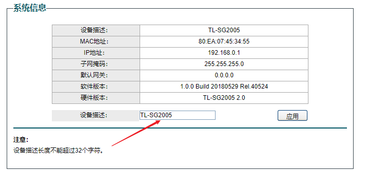

# Destruction from the Percent Sign in TP-Link Smart Switch

## Overview

- **CVE ID**: [CVE-2021-31658](https://cve.mitre.org/cgi-bin/cvename.cgi?name=CVE-2021-31658)

- **Type**: [Out-of-bounds Read *- (125)*](http://cwe.mitre.org/data/definitions/125.html) [NULL Pointer Dereference *- (476)*](http://cwe.mitre.org/data/definitions/476.html)

- **Vendor**: TP-LINK (https://www.tp-link.com)

- **Products**: Switch, such as [TL-SG2005](https://www.tp-link.com.cn/product_925.html), TL-SG2008(US), etc.

- **Version**: 2.0 (1.0.0 Build 20180529 Rel.40524)


## Severity

**High** 8.1 CVSS:3.1/AV:N/AC:L/PR:N/UI:R/S:U/C:N/I:H/A:H

## Description

The interface that provides the "device description" function only judges the length of the received data,  and does not filter special characters. This vulnerability will cause the application to crash, and all device configuration information will be erased.

For example, this interface limits the length of the string entered by the user, and also limits that the name of the switch cannot contain special characters.



However, the background interface of the switch does not filter special characters. When you enter the percent sign, web process crashes, and the switch will return to factory settings.

PoC

```shell
http://192.168.0.1/system_name_set.cgi?sysName=%
```

Reason

- When the switch decodes the url in the background, there are two characters after the percent sign by default. So when only one character is entered, the next two non-existent characters will be read out of bounds.
- The switch uses the open source C++ library to parse the parameters returned by the front end. Open source libraries generally consider exceptions. C++ handles exceptions, while self-developed C functions (switches are embedded devices and are likely to be developed in C language) did not handle exceptions, leading to process crashes and resets.

## Disclosure Timeline

- 10-Apr-2021 Discoverd the vulnerability
- 11-Apr-2021 Responsibly disclosed vulnerability to vendor
- 13-Apr-2021 Vendor Acknowledged the issue
- 16-Apr-2021 Requested for CVE-ID assignment
- 26-May-2021 CVE-ID Assigned
- 26-May-2021 Notify CVE about a publication
